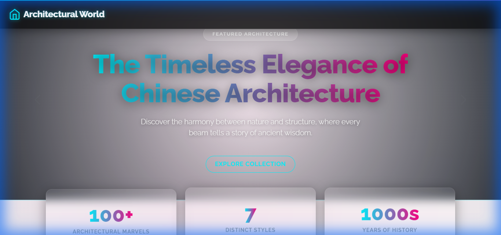
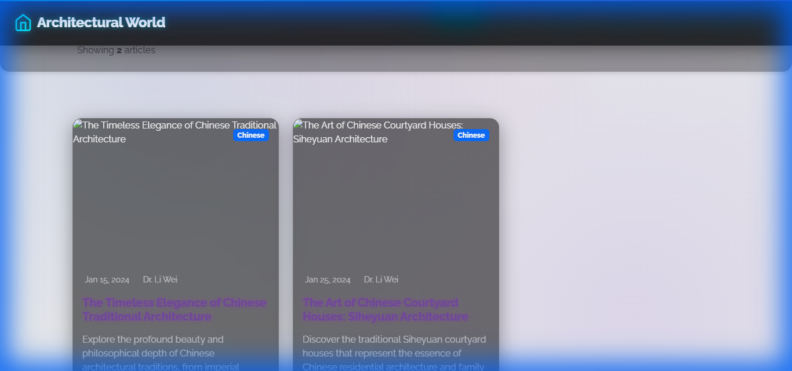

# Architectural World 🏛️✨

**Architectural World** is a modern, futuristic blog application built with **Angular v21**. It explores global architectural styles through a visually stunning **Glassmorphism & Neon** design system.



## 🚀 Features

*   **Futuristic Design System:** A custom-built dark theme featuring glassmorphism cards, neon gradients (Cyan/Purple), and animated backgrounds.
*   **Global Architecture Content:** Detailed blog posts covering Chinese, Indian, European, Japanese, Islamic, African, and Future architecture.
*   **Responsive UI:** Fully responsive layout using **Bootstrap 5** grid and custom CSS utilities.
*   **Dynamic Filtering:** Filter architecture posts by region and search by keywords instantly.
*   **High-Quality Assets:** Curated, high-resolution architectural photography from Unsplash.
*   **Modern Typography:** Uses the 'Raleway' font family for a clean, elegant look.

## 🛠️ Tech Stack

*   **Framework:** [Angular v21](https://angular.dev/) (Standalone Components, Signals)
*   **Styling:** CSS3 (Custom Variables, Animations), Bootstrap 5 (Grid/Utilities)
*   **Icons:** [Bootstrap Icons](https://icons.getbootstrap.com/) & Custom SVGs
*   **Build Tool:** Angular CLI

## 📸 Screenshots

| Blog List | Blog Detail |
| :---: | :---: |
|  |  |

## 📦 Installation & Setup

1.  **Clone the repository:**
    ```bash
    git clone https://github.com/Ajit-singh-991/arch_blog.git
    cd arch_blog
    ```

2.  **Install dependencies:**
    ```bash
    npm install
    ```

3.  **Start the development server:**
    ```bash
    ng serve
    ```

4.  **Open in Browser:**
    Navigate to `http://localhost:4200/`. The application will automatically reload if you change any of the source files.

## 🤝 Contributing

Contributions are welcome! Please check out the [CONTRIBUTING.md](CONTRIBUTING.md) file for guidelines.

1.  Fork the Project
2.  Create your Feature Branch (`git checkout -b feature/AmazingFeature`)
3.  Commit your Changes (`git commit -m 'Add some AmazingFeature'`)
4.  Push to the Branch (`git push origin feature/AmazingFeature`)
5.  Open a Pull Request

## 📄 License

Distributed under the MIT License. See `LICENSE` for more information.
